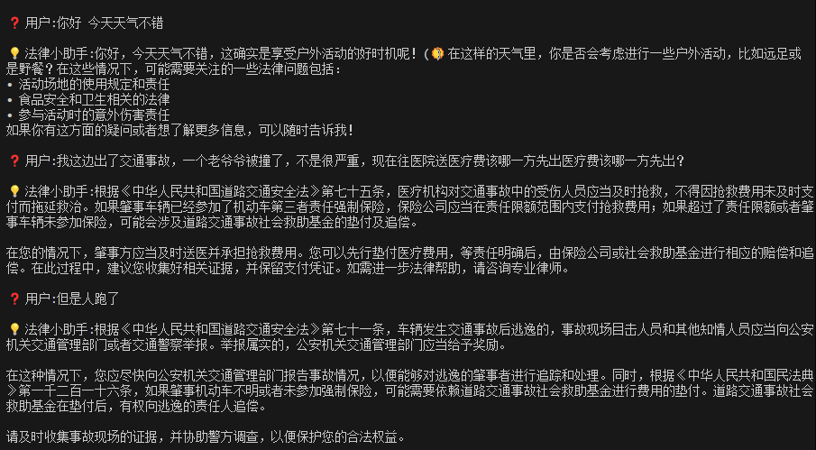

# 👨‍⚖️LawBrain/法智大模型

### 📚 法律知识 × 🧠 LLM大语言模型 × 🔍 RAG增强检索

##### 👉 最适合LLM+RAG入门实践的AI项目，零基础快速搭建智能法律顾问！

希望能够帮助你入门RAG！有问题欢迎进行提问！如果帮助到你的话可以点一个star⭐ 感谢


*演示*



基于**LangChain**框架 + OpenAI/DeepSeek（需要手动添加自己的key）+ bge嵌入+ **Chroma**


| 功能模块         | 说明                                   |
| ---------------- | -------------------------------------- |
| 🕵️意图识别     | 智能解析用户真实诉求，自动过滤无效提问 |
| 🗣️专业术语转换 | 将口语化表达自动转换为法律条文术语     |
| 📜对话历史管理   | 支持多轮对话理解                       |
| 🔎多查询检索     | 多维度查询                             |

### ⬇️快速开始

```
# todo
```

### 里程

*2025/3/1*
成功往向量化数据库存入数据

*2025/3/2*
好像回答了我的问题了！问题出在根本原因是 提示模板 和 语言模型链 之间的输入格式不匹配

*2025/03/03*

1. [X]  补全改写，可能有连续对话
2. [X]  非口语化改写
3. [ ]  搞清楚callback还有一堆runnable是啥

*2025/03/04*

1. [X]  搞清楚提示词是怎么用的
2. [X]  利用历史信息

*2025/03/05*

* [X]  完成意图识别
* [ ]  网络检索 暂时搁置

*2025/03/06*

* [X]  chain学习

*2025/03/07*

* [X]  降低成本，使用bge嵌入
* [X]  优化chain，先补全含义在进行判断
* [ ]  融合检索

  融合检索系统，它结合了基于向量的相似性搜索和基于关键词的BM25检索。这种方法旨在利用两种方法的优势，提高文档检索的整体质量和相关性。让搜索结果更加精准。

  传统的检索方法通常依赖于语义理解（基于向量）或关键词匹配（BM25）。每种方法都有其优点和缺点。融合检索旨在结合这些方法，创建一个更稳健、更准确的检索系统，有效处理更广泛的查询。
* [X]  重排序算法，使用重排序模型对文档进行打分，根据分数对文档重新排序，挑选最相关的几个

⭐ 如果这个项目对您有帮助，请点击右上角Star支持我们！

🔭 持续关注更新: 还在迭代新功能，订阅Watch获取通知！

✉ Email：leocandoit@163.com

---

🎉 用AI推动法律普惠，让正义触手可及！ 🎉
